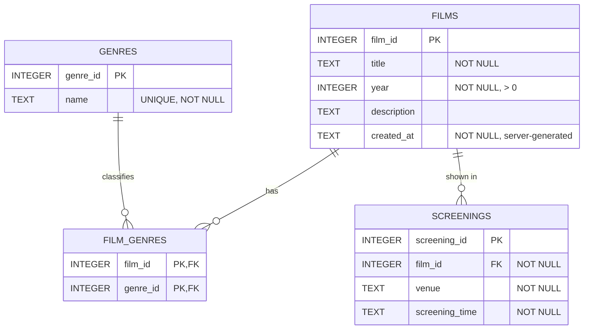

# ER Diagram

Renders on GitHub. Add column types/constraints as the schema evolves.

```mermaid
erDiagram
    FILMS ||--o{ FILM_GENRES : has
    GENRES ||--o{ FILM_GENRES : classifies
    FILMS ||--o{ SCREENINGS : "shown in"

    FILMS {
        INTEGER film_id PK
        TEXT title "NOT NULL"
        INTEGER year "NOT NULL, > 0"
        TEXT description
        TEXT created_at "NOT NULL, server-generated"
    }
    GENRES {
        INTEGER genre_id PK
        TEXT name "UNIQUE, NOT NULL"
    }
    FILM_GENRES {
        INTEGER film_id PK, FK
        INTEGER genre_id PK, FK
    }
    SCREENINGS {
        INTEGER screening_id PK
        INTEGER film_id FK "NOT NULL"
        TEXT venue "NOT NULL"
        TEXT screening_time "NOT NULL"
    }
```
